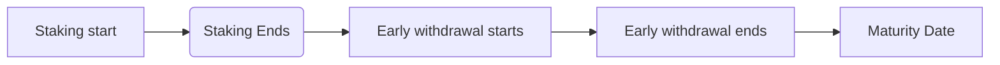
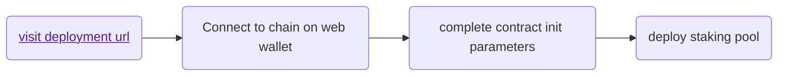
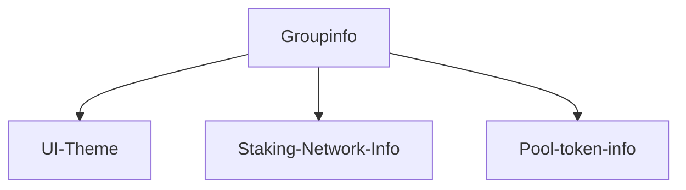
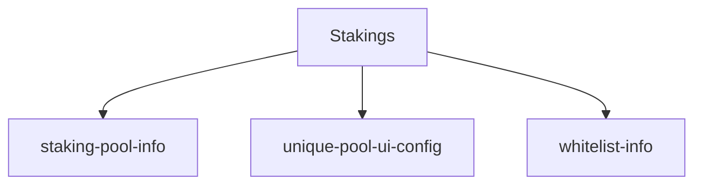
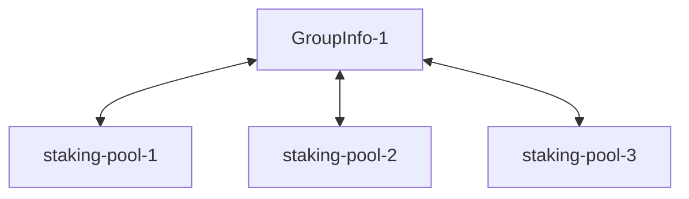

# Ferrum Staking

## Steps to Run Locally

- clone repository `https://github.com/ferrumnet/staking`.

Hardware Requirements:
- npm 14
- yarn

Respoistory directory comprises of 3 directories :
- frontend
- backend
- admin

To run Admin directory:

From terminal :-

- run yarn install

- run yarn start

- open url **https://localhost:3000/admin/deploy?network=VELAS_MAINNET&token=xx&rewardToken=xx&name=xxx&stakingCap=xxxx&stakingStart=xxx&stakingEnd=xxx&withdrawStart=xxx&withdrawEnd=xx&eventsTime=xx** in browser.

- connect metamask and swtich to velas network.

- Enter all required details to deploy a new staking contract.

- click on deploy and approve wallet transaction.

- after successful execution of transaction, deployment address is displayed on an alert box on admin dashboard.

Backend :

From terminal: -

- change directory into backend directory.

- add environment config as provided to a file .env in root backend directory.

- run yarn install

- after installation of dependencies, from terminal run `node sim_lambda.js`;

- this will start the backend on port 8080.

Frontend :

from terminal: -

- change directory into frontend directory.

- Run `yarn install`

- Run `yarn start`

- from browser, naviagte to `localhost:port/admin/login`.

- password input field is displayed, connect wallet (metamask) and enter admin password as set from config.

- on successfull login, navigates to admin dashboard.

On Admin dashboard :

**Set up groupinfo (OPTIONAL)**

The group info controls user look and feel. 

from admin dashboard, click on groupinfo tab and `add new group info` button.

- enter all required fields and save new group info.

**Add deployed contract to staking group**

- from admin dashboard, click on `stakings` cards.

- search for group info from search bar (use `frm` group if no custom group setup)

- click on preferred groupinfo

- on groupinfo details page, click on `add staking to group`

- Enter required details including smart-contract address, network, etc and save details.

- navigate to saved staking details card and enter provided url in browser. e.g `http://localhost:3001/frm/info/0x86e8d1c0e566f0d604b6316cb0eb59777eba92f8/VELAS_MAINNET`

Architecture details:

The Ferrum staking as a service is an open source implementation of ferrum’s blockchain token staking technology. 

Contract:

The ferrum staking contract allows staking is located in the contracts directory. To deply a contract , users can use the deploy UI as detailed in the frontend section below or using hardhat. To deploy using hardhat fron contract directory -

```shell

npx hardhat node
npx hardhat run scripts/deploy.js

```

The ferrum staking contract/pools allows the following periods during the pool cycle :



<br />

Backend:

The project backend is built using a single entry modularised singleton architecture with modules which are defined and intialisaed in a centralised ```stakingAppModule```. All dependencies and class modules are initialised in this single module, thus allowing a single instance of all modules to be used across an app instance.

Backend requests are processed using commands in a single ```POST``` request to the backend url with the required authorisation credentials and parameters passed in the request. Request routing is carried out in the ```httphandler``` module where each command is routed to a function implementation (controller in conventional MVC syntax). For the staking module, core implementations are implemented in ```StakingAppService``` class which includes implementation and logic for staking, unstaking, approval management and admin functionalities.


To Run Backend Implementation Locally :

#### 1. Fork `ferrum/staking` repository
<br />

#### 2. Clone your fork and CD intp backend direactory.

#### -  ``` Node.js```

#### -  ``` Npm/Yarn```

<br />

#### 3. Install dependencies

```shell
yarn install
```
<br />

#### 5. To Run Locally

```shell
node sim_lambda.js
```

<br />

#### 5. To Build

```shell
yarn build
```

<br />

Frontend: The process of deploying a staking client is divided into three steps -
- Deploy an upgradable erc20 token contract to be staked (if necessary).
- Deployment of staking contracts.
- Deployment of personalised staking UI.

**Deploying a staking contract :**
To deploy a staking contract , an intuitive UI has been created to handle the deployment of the staking contract. This simplifies the deployment of the staking contract by enabling the use of a frontend client chich requires passing in the required parameters needed to deploy the various staking smart contracts offered by ferrum. The types of staking contract/pools available to be deployed includes
- Traditional staking contract
- VIP staking contract
- Multi-token staking contract

The deployment of the staking contract involves a series of entries from url query params and also from the deployment form in the staking deploy url. The staking contract deploy url is deployed at **https://frm-admin.netlify.app/admin/deploy?network=FUSE_MAINNET&token=xx&rewardToken=xx&name=xxx&stakingCap=xxxx&stakingStart=xxx&stakingEnd=xxx&withdrawStart=xxx&withdrawEnd=xx&eventsTime=xx**

This url is composed of certain parameters for deploying staking contracts on various networks and visiting and utilizing this url for deploying staking contracts will require a web based wallet for interaction with the blockchain (metamask or walletconnect enabled wallet). The url displays a form for entering some of the parameters required for deploying a staking contract on EVM networks. Some of the form parameters can also be preloaded from url parameters thus it varies on type of staking contract and use for the staking contract to  be deployed.
 
The staking contract deployment form requires the following parameters which are required for the intialisation of the staking contract ot be deployed. Some of these parameters are loaded from url parameters and some can be edited directly in the form defined in the staking admin url. 

The parameters required for deployment of the staking contract includes :
 
*Network* : This is the network on which the desired staking contract is to be deployed and the browser wallet is expected to be connected on this network.
 
*Token* : This is a valid token address on the selected network and the base token which will be staked on the contract.
 
*Reward token* : This is the token in which users will be rewarded in the staking pool and this will be the same token in the traditional staking type and will be a different token in the liquidity staking a dn also in multi-token and VIP tokens.
 
*Staking Cap* : This is the maximum amount of tokens which can be staked on the staking contract/pool to be deployed. As denoted by the label, this is the cap on top of the staking
 
*Staking Start* : This is the exact date which staking would start for this contract/pool. It is the date which users would be able to stake the required token. Staking will be activated at the exact date specified and the time specified in the events time sequence field during contract initialisation.
 
*Staking End* : This is the date at which staking would end and users/stakers would not be able to send/stake the contract token at the exact date specified in this field and at the exact time specified in the eventsTime field during contract initialisation.
 
*Withdraw Start/Early withdrawal start date* : This is the date which users would be able to start withdrawing the rewards accrued so far during the duration of the staking contract. At this point, users/stakers who withdraw would not have the full possible APR available to that pool but it would be the APR which has been accrued so far at that point in time for that pool.
 
*Withdraw End* :  This is the date at which early withdrawal would end and users would not be able to withdraw until the maturity date for the pool as elapsed. At the date specified for this field , users would not be able to carry out early withdrawals anymore and would have to wait till the pool closes on the maturity date.
 
*Maturity date* : This is the date which users would be able to withdraw all their staked tokens and the full APR value possibly accrued over the duration of the staking period. The maturity date must be configured to occur after the date early withdrawal ends and the date staking ends.
 
*EventsTime* : The events time field to be filled in the deployment UI is the time which the staking events are to occur based on the dates provided for all the above fields i.e staking start, staking end, withdraw start, withdraw end etc.

After passing in the required paramters at the deployment url, clicking on the deploy action button triggers the connected browser wallet for approval of contract deployment on the connected chain. The contract is deployed on chain and on succcesful chain execution of contract deployment, the deployed contract address is displayed on an alert box with the owner address of the contract being the connected wallet address used during deploy.



**Staking UI deployment**

Afetr deployment of The deployment of the contract, the ferrum staking UI is built to create a unique experience for customers/clients who are use the service. The skating UI is composed of two major parts. The admin section of the staking ui is saddled with setting up the templates for the staking user page itself. This includes setting up the UI theme colors and also configuring the contract instance to the base network and currency on the deployed chain. This means that once a staking contract is deployed on ethereum network as an example, the UI is configured to prsonalise the experience during staking for the user based on the configuration set up for the contract on the selected network. At the end of configuration, the url for staking would be : 

https://url/{group-info}/info/{contract address}/{network}

e.g 
- https://staking-velas.netlify.app/velas_staking/info/0xf62ccc32bf10400167b38777d32f7e3ab461254b/VELAS_MAINNET

- https://evm-staking-dev.netlify.app/shiden_demo/info/0xea3ba6baa05fd46cd240a252173f004b5ff2a1f6/SHIDEN

**Mechanism/Steps for setting up staking UI <br />**
- Create a Groupinfo to control staking application look and feel.
- Deploy staking contract (as detailed above).
- Add and remove new staking contract to a specified staking group info.

**What is a groupinfo ? <br />**
A group info is an entry in the staking client db which represents and configures the various attributes unique to a specific staking client . This includes theming variables for styling the frontend client and component dimensions and definitions. Also the groupinfo denotes the primary currency for a staking client thus allowing the client-side application to utilize and load the required configuration and base currency for util functions and systems.

A summary of the configuration for setting up staking clientis denoted as :



**Steps to set up client/custom staking UI : <br />**

- Visit the staking admin page to set up group info https://frm-staking.netlify.app/admin/.

- On homepage, click on group info option and select `add new group info`.

- Enter the required information for creating a new group info and submit.

**To set up a group info , the entries required are : <br />**

*Group Id* - The name of the group id to be created.

*Network* - The network/chain the group id contracts will be deployed on.

*Token Address* - The client token address/base token address for the group info.

*Homepage* - The redirect page for the client side for more info on the client.

*Main Logo Url *- The logo url of the client to be displayed on the client side.

*ThemeVariables* - The theme Variables are the definition for the variables of the themes which define the look and feel of the project . The themeVariables are defined in a json variable and there are particular variables within the themeVariables which are key to the definition of the user client looks. **A quick summary of these variables within the themeVariable json are :**

*white* - This defines the background color or image for the staking client.

*themePrimary* - The defines the colors of action items such as buttons etc.

*neutralLighterAlt* - The neutral light definition is used to define the background color of the navbar and it's control items.

**After configuring groupInfo , next step involves adding contracts to groupinfo.**

**Stakings config summary :**



- From admin homepage, select stakings option

- Filter list of stakings by the group info configured for the desired client.

- Select desired group info and click on `add new staking to group`

- Enter desired info in for the staking contract to be added to the group info, The following data to be entered for staking are :

name: The name of the staking pool to be added to group info

logo: The logo to be displayed for staking pool.
 
minContribution: The min contribution allowed per user (if applicable in the case of vip staking)

maxContribution: The max contribution allowed per user (if applicable in the case of vip staking)

emailWhitelist: The email whitelist of users allowed to participate in staaking pool (if applicable)

addressWhitelist: The address whitelist of addresses allowed to participate in staking pool (if applicable)

rewardTokenPrice: The reward token price in the case of liquidity staking

Other fields in the form are auto loaded from the network on form submission and the **staking url distributed for staking is displayed at the top of the stakings page.

**Staking UI configuration summary :**



<br />

To Run Frontend Admin UI Locally :

#### 1. Fork `ferrum/staking` repository
<br />

#### 2. Clone your fork

The project uses create-react-app and requires :

#### -  ``` Node.js```

#### -  ``` Npm/Yarn```

<br />

#### 3. Install dependencies

```shell
yarn install
```
<br />

#### 5. To Run Locally

```shell
yarn start
```

<br />

#### 5. To Build

```shell
yarn build
```

<br />

#### 6. To Test

```shell
yarn test
```

<br />

# To contribute to the project

If you want to contribute to the project and make it better, your help is very welcome!. 

Contributing is useful for bug reports, feature requests and the noblest of all contributions: a good, clean pull request :).

How to contribute :

- Create a personal fork of the project on Github.
- Clone the fork on your local machine. Your remote repo on Github is called origin.
- Add the original repository as a remote called upstream.
- Be sure to pull the latest upstream changes into your local repository.
- Create a new branch to work on! Branch from develop/main.
- Implement/fix your feature, comment your code.
- From your fork open a pull request in the correct branch. Target the project's develop branch 